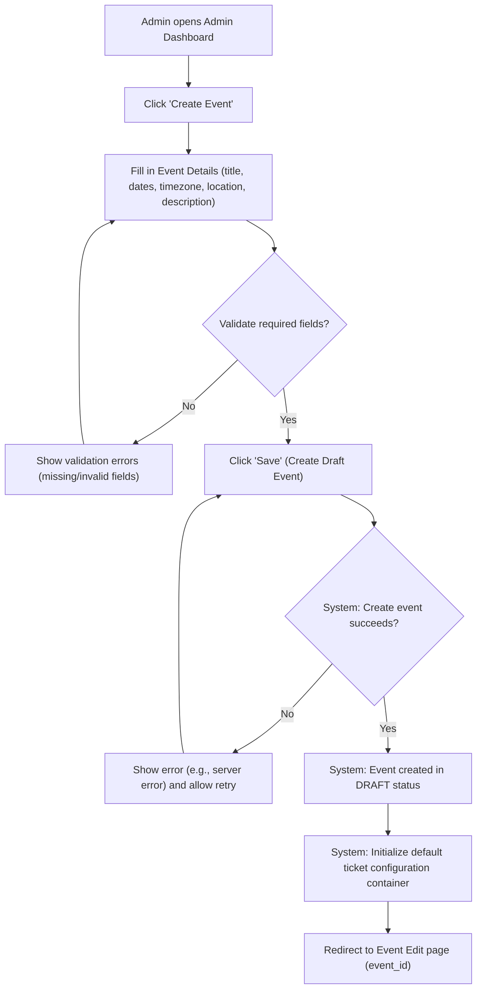
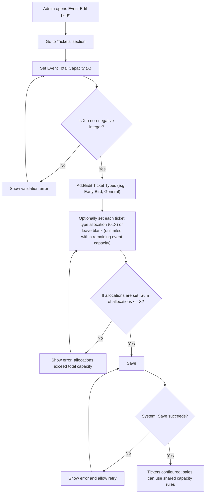
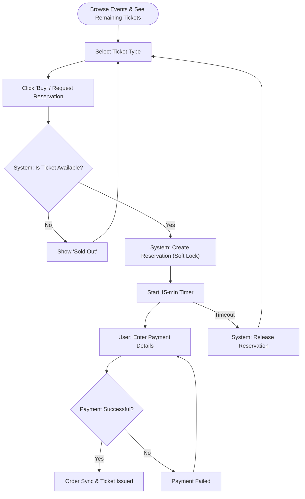

# Event Ticketing System - Requirements

## 1. Overview
The Event Ticketing System is a core commerce engine designed to sell tickets for various events. Its primary goals are to ensure data integrity (preventing overselling), handle high concurrency (race conditions), and provide a seamless checkout experience.

### 1.1 Definitions
- **Reservation**: A temporary hold on ticket quantity for a specific `TicketType`, created when a user starts checkout. A reservation has an expiry time (15 minutes) and reduces availability.
- **Order**: A purchase record created after payment succeeds (the reservation is converted into an order). Orders follow the state machine in AC6.
- **Event Total Capacity (X)**: The maximum total number of tickets that can be sold across all ticket types for an event.
- **Ticket Type Allocation**: *(Optional)* The maximum number of tickets that can be sold for a specific ticket type. If omitted, that ticket type is limited only by the remaining event capacity.
- **Event remaining**: `X - (Completed Orders All Types + Active Reservations All Types)`.
- **Ticket type remaining**:
  - If `allocation` is set: `allocation - (Completed Orders For Type + Active Reservations For Type)`.
  - If `allocation` is not set: unlimited (bounded by event remaining).

## 1.2 Data Model (MVP)
The following are the minimum data structures required to implement the flows and acceptance criteria in this document.

### 1.2.1 Event
- `id` (string/uuid)
- `title` (string)
- `description` (string, optional)
- `start_date` (datetime)
- `end_date` (datetime, optional)
- `timezone` (string, optional)
- `status` (`DRAFT` | `PUBLISHED`)
- `total_capacity` (integer, non-negative) — the **Event Total Capacity (X)**
- `created_at` / `updated_at`

### 1.2.2 TicketType
- `id` (string/uuid)
- `event_id` (FK)
- `name` (string) — e.g., Early Bird, General
- `price` (number) — MVP assumes one price per ticket type
- `allocation` (integer, optional, non-negative) — caps this ticket type only
- `is_enabled` (boolean)
- `created_at` / `updated_at`

### 1.2.3 Reservation
- `id` (string/uuid)
- `event_id` (FK)
- `ticket_type_id` (FK)
- `quantity` (integer, >0)
- `status` (`ACTIVE` | `EXPIRED` | `CONSUMED`)
- `expires_at` (datetime)
- `created_at` / `updated_at`

### 1.2.4 Order
- `id` (string/uuid)
- `event_id` (FK)
- `status` (`PAID` | `COMPLETED`) — see AC6
- `total_quantity` (integer, >0)
- `total_amount` (number)
- `payment_provider` (string, optional)
- `payment_reference` (string, optional) — e.g., payment_intent_id/transaction_id
- `created_at` / `updated_at`

### 1.2.5 OrderItem
- `id` (string/uuid)
- `order_id` (FK)
- `ticket_type_id` (FK)
- `quantity` (integer, >0)
- `unit_price` (number)
- `line_total` (number)

## 1.3 User Flows

### 1.3.1 Admin User Flow: Create an Event

### 1.3.2 Admin User Flow: Configure Ticket Types (MVP: Shared Total Capacity)

### 1.3.3 Customer User Flow (High-level)

## 1.4 Event Publishing Rules (MVP)
- Events are created as `DRAFT` (see AC A3).
- Only events in `PUBLISHED` status are visible to customers and can be purchased.
- An event can be published only if:
  - it has a non-negative `total_capacity` (X), and
  - it has at least one `TicketType` with `is_enabled = true`.

## 1.5 Payment & Expiration Handling (MVP)
### 1.5.1 Reservation lifecycle
- Hold duration is 15 minutes (see AC7).
- A reservation starts in `ACTIVE` and becomes `EXPIRED` after `expires_at`.
- When payment succeeds, the system converts related `ACTIVE` reservation(s) to `CONSUMED` and creates an `Order`.

### 1.5.2 Payment integration (minimal contract)
- The system must store a `payment_reference` on the `Order` (e.g., payment intent / transaction ID).
- Payment success is the only trigger to create an `Order` (see AC6 note).
- Payment retries are allowed only while the reservation is `ACTIVE` (see AC7 note).

### 1.5.3 Expiration cleanup strategy
To ensure expired holds no longer reduce availability:
- The system must treat reservations with `expires_at < now()` as not available for new purchases.
- The system should also periodically mark expired reservations as `EXPIRED` (e.g., via a scheduled job), so availability queries remain fast and consistent.

## 2. User Stories

### 2.1 Customer Stories
- **Browse Events**: As a Customer, I want to see a list of upcoming events so that I can decide which one to attend.
- **View Ticket Options & Availability**: As a Customer, I want to see ticket types (e.g., Early Bird, VIP) and how many are available so that I can choose the right option before purchasing.
- **Reserve Tickets (Soft Lock)**: As a Customer, I want the system to reserve my selected tickets when I start checkout so that they are held for me while I complete payment.
- **See Reservation Timer**: As a Customer, I want to see how long my reservation will be held so that I can finish checkout before it expires.
- **Handle Sold Out / Insufficient Inventory**: As a Customer, I want to be told immediately if tickets are sold out or my requested quantity can’t be reserved so that I can adjust my selection.
- **Secure Checkout**: As a Customer, I want to pay for my tickets using a reliable payment gateway so that my transaction is secure.
- **Payment Failure & Retry**: As a Customer, I want to retry payment if it fails (while my reservation is still active) so that I can complete my purchase without starting over.
- **Receive Confirmation**: As a Customer, I want to receive an order confirmation and ticket issuance after successful payment so that I can attend the event.
- **Reservation Expiry**: As a Customer, I want the system to release my held tickets if I don’t complete payment in time so that other customers can buy them.

### 2.2 Admin Stories
- **Manage Events**: As an Admin, I want to create and edit events so that I can list new conferences or workshops.
- **Create Draft Event**: As an Admin, I want to create a new event as a draft so that I can save progress before publishing.
- **Validation Feedback**: As an Admin, I want to see clear validation errors when creating an event so that I can fix issues quickly.
- **Default Setup**: As an Admin, I want the system to initialize sensible defaults for ticket configuration when I create an event so that I can start adding ticket types immediately.
- **Manage Inventory**: As an Admin, I want to set and update the ticket capacity for each event so that I can control how many people can attend.
- **Order Tracking**: As an Admin, I want to view a list of all orders and their statuses so that I can manage attendee data.
- **Set Total Capacity**: As an Admin, I want to set a total capacity (X) for an event so that total attendance never exceeds X.
- **Configure Ticket Type Allocations**: As an Admin, I want to optionally set an allocation (0..X) per ticket type, or leave it blank to rely only on the overall cap, so that I can control the mix when needed without complicating simple events.

## 3. Acceptance Criteria

### 3.0 Admin: Event Creation
- [AC A1] The system must allow an authenticated Admin to create a new event.
- [AC A2] Creating an event must validate required fields at minimum: `title`, `start_date` (and `end_date` must be >= `start_date` when provided).
- [AC A3] When an event is created, it must be saved in `DRAFT` status by default.
- [AC A4] After event creation, the system must initialize default ticket configuration data (at minimum, a ticket configuration container for adding ticket types).

### 3.0B Admin: Ticket Types & Capacity (MVP)
- [AC T1] Each event must have a single **Event Total Capacity (X)** that represents the maximum number of tickets that can be sold across all ticket types.
- [AC T2] The Admin must be able to create, edit, and disable ticket types for an event.
- [AC T3] Each ticket type may optionally define an **allocation** (non-negative integer) in the range `0..X`.
- [AC T4] The system must reject any configuration where the sum of all **defined** ticket type allocations is greater than `X`.
- [AC T5] The system must allow configurations where some ticket types have `0` allocation (e.g., `Early Bird = X`, `General = 0`).
- [AC T6] The customer-facing availability for a ticket type must be computed as follows:
  - `event_remaining = X - (completed_orders_all_types + active_reservations_all_types)`
  - If the ticket type has an allocation:
    - `ticket_type_remaining = allocation - (completed_orders_for_type + active_reservations_for_type)`
    - `available_to_customer = min(ticket_type_remaining, event_remaining)`
  - If the ticket type has no allocation:
    - `available_to_customer = event_remaining`
- [AC T7] **Business expectation (MVP model)**: allocations are typically used for limited, cheaper ticket types (e.g., Early Bird) and are expected to sell out before unallocated (or higher-priced) ticket types.
  - **Note**: An allocation caps sales for that ticket type but does **not** reserve capacity; all ticket types still share the same event total capacity `X`.

### 3.1 Inventory Management
- [AC 1] The system must maintain a real-time count of available tickets for each `TicketType` (availability must subtract active reservations).
- [AC 2] When a user starts checkout (requests a reservation), the system must perform an "Inventory Lock" (reserve the items).
- [AC 3] If the requested quantity exceeds the available inventory, the request must be rejected with an "Insufficient Inventory" error.

### 3.2 Concurrency & Inventory Strategy
- [AC 4] **Soft Reservation (Implicit Lock)**: The system shall use a "Reserve First, Pay Later" strategy.
    - When a user enters checkout, a temporary "Reservation" is created.
    - Event remaining = `X - (Completed Orders All Types + Active Reservations All Types)`.
    - Ticket type remaining = `allocation - (Completed Orders For Type + Active Reservations For Type)`.
    - **Note**: Strict Row-Locking is NOT required due to low concurrency expectations (approx. 30 attendees/event).
- [AC 5] All inventory updates for *finalized sales* must be performed within a database transaction.

### 3.3 Order Transitions
- [AC 6] Orders must follow a strict state machine: `Paid` -> `Completed`.
  - **Note**: An order is created only after payment succeeds (a reservation does not create an order by itself).
- [AC 7] A timer should be set for the "Inventory Lock"; if payment is not received within 15 minutes, the lock must be released.
  - **Note**: Payment retries are only allowed while the reservation is still active (not expired). Once expired, the customer must create a new reservation.

## 4. Non-functional Requirements
- **Scalability**: Capable of handling bursts of traffic during popular event ticket releases.
- **Security**: Payment webhook signatures must be verified.
- **Reliability**: Transactional integrity using PostgreSQL ACID properties.
